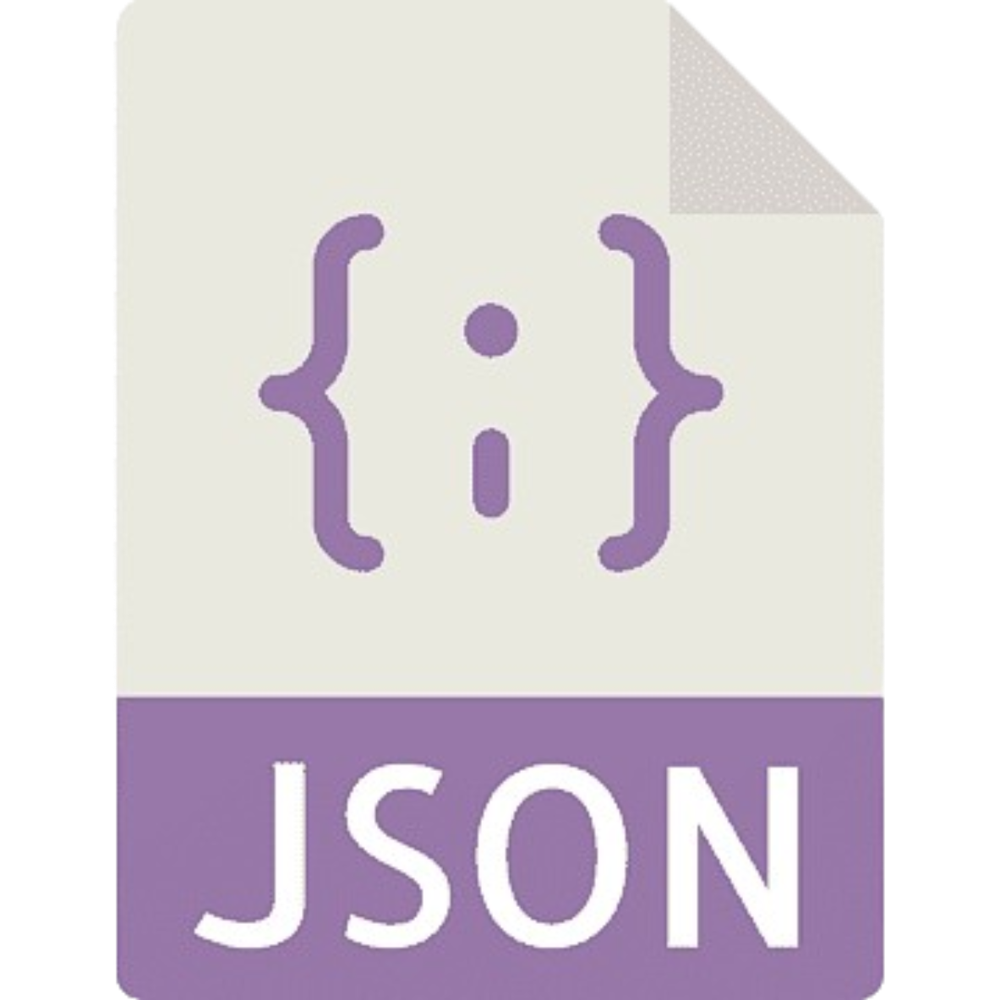
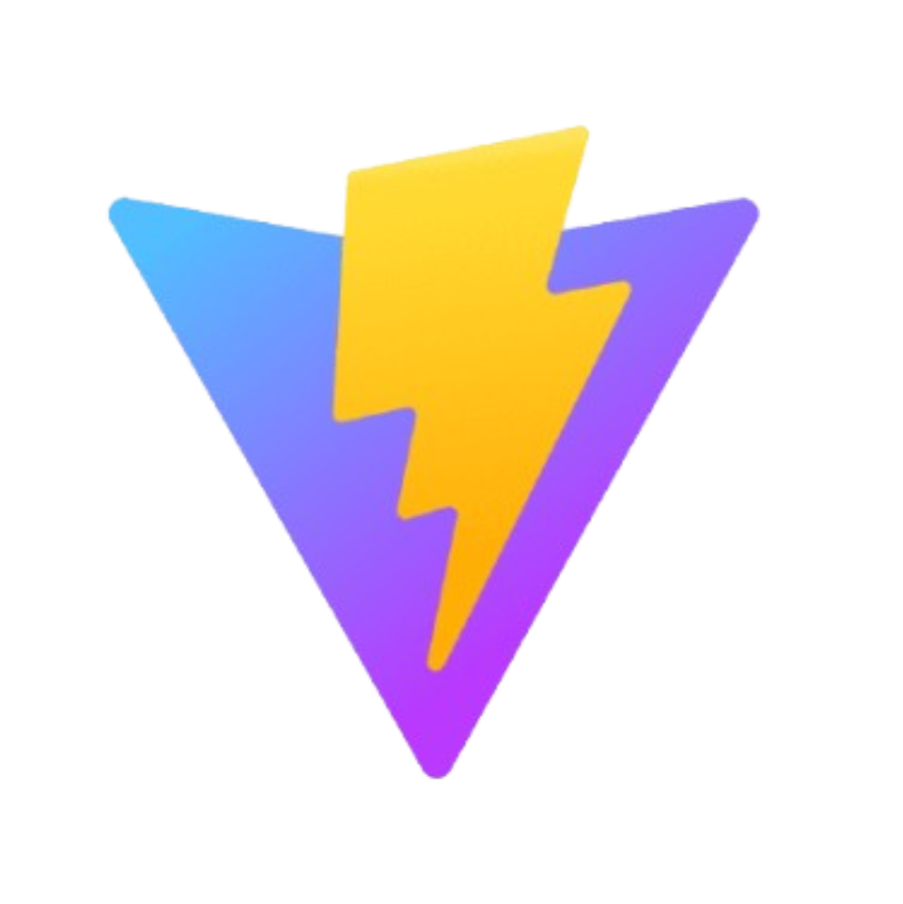

# Web FPGA - Team 5

This project involves creating a web-based interface for an FPGA simulator that visually demonstrates how signals propagate within an FPGA. It is designed to serve as an educational tool. Our goal is to help users understand FPGA internals by merging a 2D floorplan view of the FPGA (showing its basic elements and the interconnections between them) with a dynamic simulation of signal timing.

## Installing / Getting started

A quick introduction of the minimal setup you need.

```shell
commands here
```

This section explains what happens when you execute the code above.

## Documentation of the project

- This document describes what the software should do by outlining user requirements and expected functionalities :
  - **[Functional Specifications](documents/functional/functionalSpecifications.md)**

- This document details how the software will be built, including architecture, design, and technology choices.
  - **[Technical Specifications](documents/technical/technicalSpecifications.md)**
  
- This document officially initiates the project by defining its scope, objectives, stakeholders, and overall framework.
  - **[Project Charter](documents/management/projectCharter.md)**
  
- This document outlines the strategy, procedures, and criteria for verifying that the system meets its requirements.
  - **[Test Plan](documents/qualityAssurance/testPlan.md)**
  
- This document provides end-users with instructions on how to use the system and troubleshoot common issues.
  - **[User Manual](documents/manual/userManual.md)**

## Developing

### Built With

The list of the main libraries and frameworks used in our project :

| **Category** | **Technology/Tool**   | **Link**                                                                                                  | **Description**                                                                |
| ------------ | --------------------- | --------------------------------------------------------------------------------------------------------- | ------------------------------------------------------------------------------ |
| Frontend     | React.js              | [](https://react.dev)              | JavaScript library to create dynamic user interfaces.                          |
| Frontend     | D3.js                 | [](https://d3js.org)                   | Library to create dynamic data visualizations.                                 |
| Backend      | Node.js & Express.js  | [](https://nodejs.org)           | JavaScript server-side runtime environment with a framework for creating APIs. |
| Database     | No DB                 | [](https://www.json.org/json-en.html) | Store as JSON.                                                                 |
| Other        | Vite                  | [](https://vitejs.dev)                | Tool to manage and build JavaScript modules.                                   |

**Language:** JS

### Prerequisites

What is needed to set up the dev environment. For instance, global dependencies or any other tools. include download links.

## Tests

Describe and show how to run the tests with code examples.
Explain what they test and why.

```shell
Give an example
```

## API Description

In this section you'll be provided with the link to [api documentation](./documents/technical/APIDocumentation.md).

## Contributors

| Photo                                                                                                                                     | Role              | Name             | Contact                                                                                                            |
| ----------------------------------------------------------------------------------------------------------------------------------------- | ----------------- | ---------------- | ------------------------------------------------------------------------------------------------------------------ |
|    | Project Manager   | Robin GOUMY      | [GitHub](https://github.com/RobinGOUMY) \| [LinkedIn](https://www.linkedin.com/in/robin-goumy-66452832a/)          |
|    | Program Manager   | Alexandre BOPP   | [GitHub](https://github.com/Boppalex) \| [LinkedIn](https://www.linkedin.com/in/alexandre-bopp-682a97250/)         |
|   | Technical Leader  | Maxime THIZEAU   | [GitHub](https://github.com/MaximeTAlgosup) \| [LinkedIn](https://www.linkedin.com/in/maxime-thizeau-0b311a293/)   |
|   | Software Engineer | Geoffrey Delrieu | [GitHub](https://github.com/Z2VvZ2Vv) \| [LinkedIn](https://www.linkedin.com/in/geoffrey-delrieu-77203a353/)       |
|  | Quality Assurance | Mathias DELILLE  | [GitHub](https://github.com/MistzSoftware) \| [LinkedIn](https://www.linkedin.com/in/mathias-gagnepain-426a131b0/) |
|   | Technical Writer  | Habi CAILLEAU    | [GitHub](https://github.com/habicll) \| [LinkedIn](https://www.linkedin.com/in/habi-cailleau-3b72b5293/)           |
