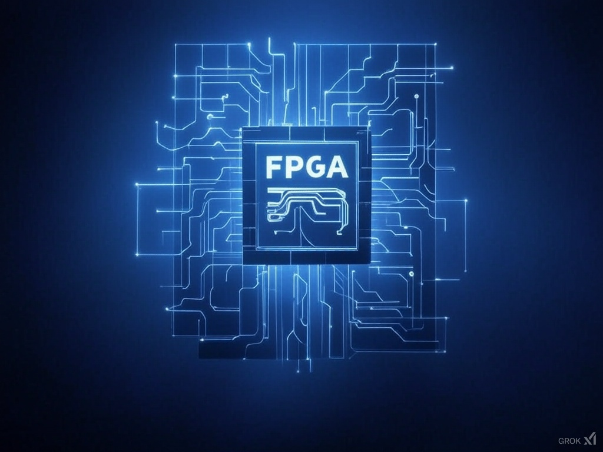

# Functional Specifications Project Web FPGA

**Author:** Alexandre Bopp

### *Last update on March 29, 2025*

**Team:** 5

| Role | Name |
|---|---|
| Project Manager       | Robin GOUMY       |
| Program Manager       | Alexandre BOPP         |
| Tech Lead             | Maxime THIZEAU   |
| Technical Writer      | Habi CAILLEAU      |
| Software Developer    | Geoffrey        |
| Quality Assurance     | Mathias GAGNEPAIN       |

---

## Table of content

---

## Introduction

### Presentation Document

The purpose of a functional specification is to define the requirements to be implemented by the software solution.

### Presentation Project

The aim of this project is to develop a web-based interface for an FPGA simulator that will be used for educational purposes. The interface will provide students and teachers with a visualization of FPGA signal propagation in real-time. It will integrate tools for synthesis, place and route (P&R), and timing simulation to offer a comprehensive learning experience. The FPGA model primarily targeted is the NanoXplore NGultra, with additional support for a basic Xilinx Series 7 model using the VTR flow. The project is expected to provide an interactive 2D view of the FPGA's layout, showing BEL utilization and signal routing, synchronized with time evolution during the simulation process.

### Presentation Team & Roles

| Role                 | Description                                                                                          |
|----------------------|------------------------------------------------------------------------------------------------------|
| **Project Manager**  | Oversees planning, organization, and budgeting. Ensures the team stays on track and motivated.   |
| **Program Manager**  | Defines project goals and ensures alignment with expectations. Leads design efforts. Authors Functional Specifications. |
| **Tech Lead**        | Drives technical decisions. Translates Functional Specifications into Technical Specifications. Reviews code and provides guidance. |
| **Technical Writer** | Develops and maintains documentation, including user manuals and technical guides. Collaborates with engineers to ensure clarity and accuracy. Makes documentation accessible and user-friendly. |
| **Software Engineer** | Implements features by writing code. Participates in technical design and maintains documentation. |
| **Quality Assurance** | Tests features to identify bugs and inconsistencies. Documents issues and verifies fixes. Develops and executes test plans. |

## Stakeholders

| Name           | Occupation                  | Links                          |
|----------------|-----------------------------|--------------------------------|
| Franck JEANNIN | Client (ALGOSUP's director) | [Website](https://algosup.com) |
| Teachers       | FPGA educators using the tool for instructional purposes | N/A |
| Students       | Learners using the tool for educational purposes | N/A |
| Developers     | Software engineers and FPGA specialists responsible for implementation | N/A |
| FPGA Tool Providers | NanoXplore, Impulse, ModelSim, VTR Developers | [NanoXplore Wiki](https://nanoxplore-wiki.atlassian.net/wiki/) |

### Glossary

| Term               | Definition |
|--------------------|------------|
| **FPGA**          | A reconfigurable integrated circuit with basic elements and preconfigured electrical signal routes. |
| **Basic Element (BEL)** | Hardware electrical resources available inside an FPGA, such as flip-flops, Look-Up Tables (LUTs), and Block RAM. |
| **Application**    | The function to be executed in the FPGA, developed in Verilog. |
| **Synthesis**      | Translates the application into an electrical equivalent, creating a netlist. Uses tools like Impulse or Yosys (VTR flow). |
| **P&R (Place & Route)** | Assigns netlist components to BELs (placement) and selects routes for signals between BELs (routing). Uses Impulse or VPR. |
| **Simulator**      | Compiles Verilog testbenches and executes signal propagation simulations over time. Uses ModelSim. |
| **Software**       | The web application developed for this project. |
| **Testbench**      | A Verilog script used to verify FPGA design functionality by simulating expected behavior. |
| **Timing Netlist** | A Verilog representation of the application, including signal time propagation details. |

---

## Requirements

Project requirements are the specific standards, factors, or conditions a project needs to meet in order to be successful. Requirements help the project team understand what their goals are, what limitations they have, and what they want to achieve.

### Functional Requirements

1. **Web-Based Interface**
   - Provide an intuitive, responsive UI for FPGA simulation visualization.
   - Enable **zooming, panning, and selecting components** in the FPGA layout.
   - Support **real-time synchronization of signal propagation** with the FPGA layout.
   - Implement **play, pause, and resume functionality** for visualizing signal propagation.
   - Support **multiple simulation speeds** (e.g., x1, x2, x4).

2. **FPGA Model Support**
   - Implement visualization support for **NanoXplore NGultra** and **Xilinx Series 7** FPGA models.

3. **Simulation and Debugging**
   - Display an **interactive 2D view** of the FPGA layout.
   - Visualize **BEL utilization** and **signal routing** in the FPGA layout.
   - Provide tools for **debugging** and analyzing signal behavior.

4. **Integration with Synthesis and P&R Tools**
   - Integrate with **Impulse, VPR, and Yosys** for synthesis and P&R operations.
   - Convert **Verilog applications** into FPGA-compatible **netlists** for visualization.

5. **Teacher Backend System**
   - Allow **teachers to upload Verilog applications and testbenches** to the backend.
   - Process and prepare the uploaded applications for visualization in the web interface.

6. **Example Applications**
   - Provide **preloaded example applications** for demonstration (e.g., **Flip-Flop** and **LUT4**).

### Non-Functional Requirements

1. **Performance**
   - Ensure real-time rendering and responsiveness.
   - Optimize large-scale FPGA model visualization.

2. **Scalability**
   - Support multiple FPGA configurations and models.
   - Maintain efficiency with increasing simulation complexity.

3. **Usability**
   - Provide clear documentation for students and teachers.
   - Implement user-friendly navigation and UI design.

4. **Security**
   - Secure data exchanges and prevent unauthorized access.
   - Implement authentication for different user roles.

### Technical Constraints

- The **frontend and backend technologies are not predefined**, allowing the Tech Lead to select the most suitable stack.
- The **solution must integrate with external tools like Impulse, ModelSim, Yosys, and VPR as needed**.
- The web application must be **cross-platform** and **ensure compatibility with major browsers** (Chrome, Firefox, Edge, Safari).
- The **backend should support handling Verilog applications and testbenches**, preparing the necessary data for visualization.
- The system should support **a scalable architecture** to handle increasing numbers of users and applications.

### Deliverables

Deliverables, which refer to the specific documents that a project intends to produce and deliver to its stakeholders, are crucial to project management.

### Deliverables Overview

| Name                    | Deadline   | Link                         | Description |
| ------------------------ | ---------- | ---------------------------- | ----------- |
| Functional Specifications | 13/03/2025 | [FunctionalSpecifications.md](#) | This document outlines the high-level functionality and requirements of the FPGA simulation web application, ensuring a shared understanding between stakeholders and the development team. |
| Technical Specifications | 25/03/2025 | [TechnicalSpecifications.md](#) | This document provides a detailed breakdown of the architecture, tools, and technologies used in the project, including system design, database schema, and API specifications. |
| Code                     | 01/04/2025 | [Folder source](#)            | The source code for the FPGA simulation tool, organized in a repository and including all files necessary to run and build the project. |
| Test Plan                | 25/03/2025 | [TestPlan.md](#)              | Defines the testing strategy and methodology, outlining types of testing (unit, integration), tools, and testing schedules. |
| Test Cases               | 25/03/2025 | [TestCases.md](#)             | A set of detailed test cases to verify that the FPGA simulation tool works as expected, including inputs, expected results, and validation procedures. |
| User Manual              | 25/03/2025 | [UserManual.md](#)            | Provides instructions for end-users on how to navigate and use the FPGA simulation interface, including common tasks like running simulations and interpreting results. |

---

## Context

### Personas

#### Persona 1: Dr. Alice Martin

- **Role**: Teacher (FPGA Design Instructor)  
- **Age**: 42  
- **Background**: PhD in Electrical Engineering, 10+ years teaching FPGA design.  
- **Needs**: A tool for teaching FPGA concepts with interactive 2D layouts and signal visualization.  
- **Goals**: Make complex FPGA concepts easier for students and provide real-time feedback on signal behavior.

---

#### Persona 2: John Rivera

- **Role**: Student (FPGA Design Learner)  
- **Age**: 24  
- **Background**: Final-year Computer Engineering student, beginner in FPGA design.  
- **Needs**: Simple tool for visualizing FPGA layout and signal propagation.  
- **Goals**: Learn FPGA design concepts through hands-on simulation and gain practical experience.
