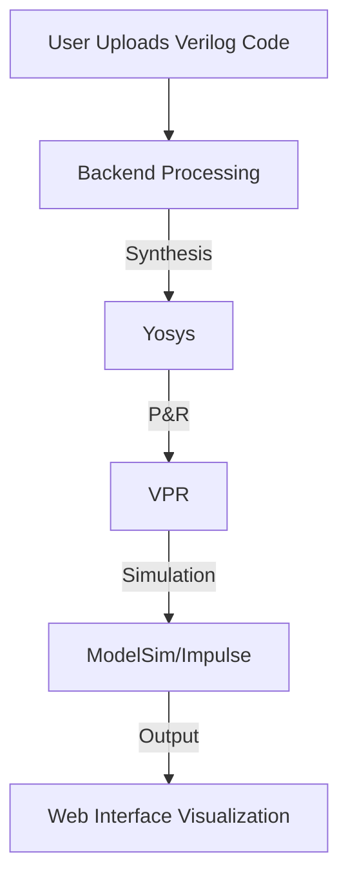
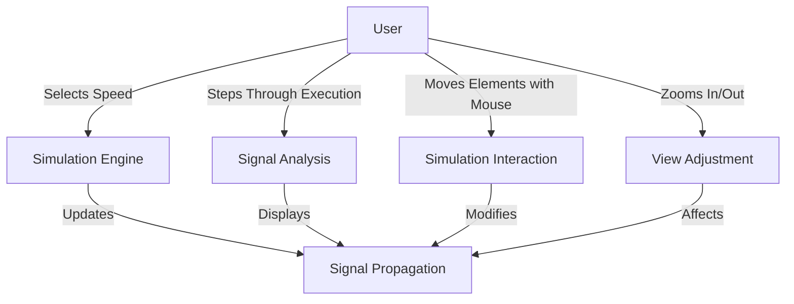
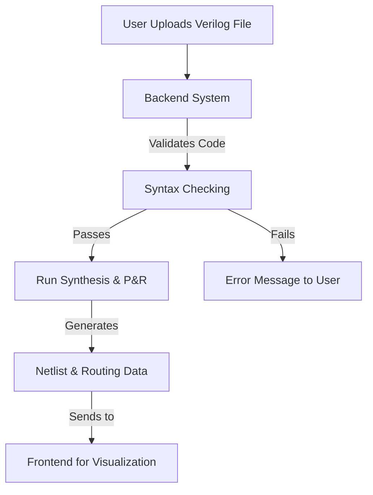

# Functional Specifications Project Web FPGA

**Author:** Alexandre Bopp

**Title:** SPIN

### *Last update on March 14, 2025*

**Team:** 5

| Role | Name |
|---|---|
| Project Manager       | Robin GOUMY       |
| Program Manager       | Alexandre BOPP    |
| Tech Lead             | Maxime THIZEAU    |
| Technical Writer      | Habi CAILLEAU     |
| Software Developer    | Geoffrey DELRIEU  |
| Quality Assurance     | Mathias DELILLE    |

---

## Table of content

---

## Introduction

### 1. Presentation Document

The purpose of a functional specification is to define the requirements to be implemented by the software solution.

### 2. Presentation Project

The goal of this project is to create a web-based interface for an FPGA simulator designed for educational use. This interface will help students and teachers visualize FPGA signal propagation in real time. It will integrate essential tools for synthesis, placement and routing (P&R), and timing simulation to provide a complete learning experience.

The simulator will primarily support the NanoXplore NGultra FPGA, with additional basic support for Xilinx Series 7 using the VTR flow. Users will be able to explore an interactive 2D FPGA layout, where they can see how signals travel, how resources (BELs) are utilized, and how everything evolves over time during the simulation.

### 3. Presentation Name

**Why SPIN ?**

SPIN stands for **Signal Propagation Inspector**. We chose this name because it is short, impactful, and conveys the core functionality of our tool. A concise yet meaningful name enhances clarity and memorability, making it more effective for users.

### 4. Presentation Team & Roles

| Role                 | Description                                                                                          |
|----------------------|------------------------------------------------------------------------------------------------------|
| **Project Manager**  | Oversees planning, organization, and budgeting. Ensures the team stays on track and motivated.   |
| **Program Manager**  | Defines project goals and ensures alignment with expectations. Leads design efforts. Authors Functional Specifications. |
| **Tech Lead**        | Drives technical decisions. Translates Functional Specifications into Technical Specifications. Reviews code and provides guidance. |
| **Technical Writer** | Develops and maintains documentation, including user manuals and technical guides. Collaborates with engineers to ensure clarity and accuracy. Makes documentation accessible and user-friendly. |
| **Software Engineer** | Implements features by writing code. Participates in technical design and maintains documentation. |
| **Quality Assurance** | Tests features to identify bugs and inconsistencies. Documents issues and verifies fixes. Develops and executes test plans. |

### 5. Stakeholders

| Name           | Occupation                  | Links                          |
|----------------|-----------------------------|--------------------------------|
| Florent MANNI  | Client CNES worker | [Website](https://cnes.fr/) |

### 6. Glossary  

| **Term**             | **Definition** |
|----------------------|--------------|
| **FPGA (Field-Programmable Gate Array)** | A reconfigurable integrated circuit that contains an array of programmable logic blocks and interconnects, allowing custom digital circuit designs. Unlike microcontrollers or CPUs, FPGAs are not pre-programmed and require users to configure their functionality. |
| **Basic Element (BEL)** | The fundamental building blocks inside an FPGA, including flip-flops (for storing state), Look-Up Tables (LUTs) (for implementing logic functions), and Block RAM (for memory storage). These elements are combined to create complex digital designs. |
| **Application**      | A digital circuit or function that is implemented on an FPGA, typically described using a Hardware Description Language (HDL) like Verilog or VHDL. |
| **Synthesis**        | The process of converting a high-level Verilog or VHDL description into a gate-level representation (netlist) that the FPGA can understand. This step ensures the design meets logic and timing constraints. Tools like **Impulse** and **Yosys (VTR flow)** are used for this process. |
| **P&R (Place & Route)** | The process of mapping a synthesized netlist onto an FPGA. **Placement** assigns logic components to BELs, while **Routing** determines the electrical paths for signals between BELs. This step ensures that the design functions correctly and meets timing constraints. Tools like **Impulse** and **VPR** are used. |
| **Simulator**        | A tool that allows testing of FPGA designs before actual implementation. It compiles **Verilog testbenches** and executes signal propagation simulations over time to validate design behavior. **ModelSim** is commonly used for this purpose. |
| **Software**         | The web-based FPGA simulation and visualization tool developed for this project. It provides an interactive interface for loading, visualizing, and testing FPGA circuits. |
| **Testbench**        | A **Verilog script** that defines test scenarios to verify the correctness of an FPGA design. It provides stimulus (input signals) and checks expected outputs to ensure the circuit functions as intended. |
| **Timing Netlist**   | A special type of **Verilog netlist** that includes **detailed signal propagation timing information**. It is used for analyzing performance, ensuring that the FPGA design meets timing constraints, and preventing issues like setup and hold violations. |
| **Scalability**      | The ability of the FPGA simulation tool to handle increasingly larger designs or more complex architectures without performance degradation. Scalability is essential for ensuring that the tool remains useful as design complexity grows. |
| **Latency**         | The delay between an input stimulus and its observable response in the FPGA simulation. Lower latency improves real-time feedback and makes the tool more responsive for users. |
| **Throughput**       | The amount of data or number of operations processed per unit of time. In FPGA simulation, high throughput ensures efficient execution of large-scale models. |
| **Clock Cycle**      | The fundamental unit of time in an FPGA design, determined by the clock signal that synchronizes operations. The number of clock cycles required for a computation impacts performance. |
| **Power Optimization** | Techniques used to minimize power consumption in FPGA designs, such as clock gating, power gating, and dynamic voltage scaling. While not a primary concern in simulation, power-aware synthesis can improve energy efficiency. |
| **LUT (Look-Up Table)** | A key component in FPGAs that implements combinational logic functions. The number of LUTs available in an FPGA affects its computational capacity. |
| **Routing Congestion** | A situation where there are too many signals competing for routing resources inside the FPGA, leading to performance bottlenecks and increased delay. |
| **Resource Utilization** | The percentage of FPGA elements (LUTs, flip-flops, DSP blocks, etc.) used by a given design. Efficient resource utilization ensures that designs fit within FPGA constraints. |
| **Parallelism**      | The ability to execute multiple operations simultaneously within an FPGA. FPGAs excel at parallel processing compared to traditional CPUs. |
| **Bitstream**        | The final compiled file that configures the FPGA hardware. The bitstream is generated after synthesis and place-and-route steps and is loaded onto the FPGA for execution. |
| **Verification**     | The process of ensuring that an FPGA design behaves as intended before deployment. This includes functional simulation, timing analysis, and formal verification methods. |

---

## Requirements  

Project requirements define the necessary standards, conditions, and constraints for the FPGA web interface project. These ensure that the project meets its intended purpose while staying within the defined scope.  

### 1. Core Requirements  

- Develop a **web-based interface** for **FPGA simulation** focused on **educational purposes**.  
- Provide **real-time visualization** of **FPGA signal propagation**.  
- Support **NanoXplore NGultra** as the primary FPGA model, with additional support for **Xilinx Series 7** via the **VTR flow**.  
- Integrate with **synthesis, place & route (P&R), and timing simulation tools** (Impulse, ModelSim, Yosys, VPR).  
- Ensure an **interactive and intuitive** experience for both **students and teachers**.  
- Display an **FPGA layout with BEL utilization and signal routing** synchronized with **time evolution during simulation**.  

---

### 2. Functional Requirements

The core requirements define the fundamental objectives of the FPGA web interface project. These are the essential functionalities and integrations required to achieve the project's purpose.

#### a. Web-Based Interface  

The application must provide a user-friendly and responsive interface for FPGA simulation. It should support:  

##### **Mockups of the Application**  

**Legend:**  
The red arrows present in the images are just for guidance and are not part of the final mockup.  

##### **Main Page**

Upon arriving on the website, users can choose one of the following modes:  *

- **Student Mode**  
- **Preview Mode**  
- **Teacher Mode (Creative Mode)**  

  

##### **Teacher, Creation & Management**

If the user selects **Teacher Mode**, they will be redirected to this page, where they can manage examples efficiently:

- **Create new examples** in the easiest way possible.  
- **Delete old examples** to keep the library relevant.  
- A button at the bottom allows **returning to the visualization page**.  

 
 

##### **Student, Visualization**

If the user selects **Student Mode** (or if a teacher clicks on the **visualization button**), they will be redirected to the final **student page**.  

- Users can **select an example** from a list.  
- Once selected, the **preview** of the FPGA simulation will be displayed below.  
- The interface will show **signals and all available features** for interaction.  

  

##### **Website color chart**

| COLOR                          | TYPE      |
|--------------------------------|----------|
| #14002b | Primary   |
| #ffffff | Secondary |
| #000000 | Tertiary  |

#### b. FPGA Model Support  

The system must be compatible with multiple FPGA architectures to ensure flexibility in teaching and learning:

- **Primary FPGA Model**: NanoXplore NGultra.  
- **Secondary Support**: Xilinx Series 7 via the VTR flow.  

#### c. Visualization Features  

To enhance user understanding of FPGA operations, the system must include:  

- An **interactive 2D FPGA layout** that accurately represents the circuit.  
- Dynamic **BEL utilization and signal routing** visualization.  

#### d. Tool Integration  

To ensure a seamless FPGA simulation workflow, SPIN will integrate multiple tools.  

- **Impulse, ModelSim, Yosys, and VPR** for synthesis, place & route (P&R), and simulation tasks.  
- Automated conversion of **Verilog applications into FPGA-compatible netlists** for visualization.

| **Stage**            | **NanoXplore (NGultra)** | **Xilinx (Series 7)** |
|----------------------|------------------------|----------------------|
| **Synthesis**       | Impulse                 | Yosys               |
| **Place & Route**   | Impulse                 | VPR                 |
| **Timing Simulation** | Impulse               | VPR                 |
| **Testbench Execution** | ModelSim           | ModelSim             |

##### **Flowchart: Tool Integration Process**  

#### e. Simulation Control  

To offer a flexible learning experience, the system should allow users to:

- Adjust **simulation speed** (e.g., x1, x2, x4).  
- Step through execution to analyze signal propagation at different moments.  
- **Play, pause, and resume simulation** for better control.
- **Interact with simulation elements** using the mouse (drag and move components).  
- **Zoom functionality** to enhance visibility and precision.  

##### **Flowchart: Simulation Control**

#### f. Backend Processing  

The backend system must efficiently handle simulation requests and provide seamless integration between the frontend and FPGA tools:  

- **Support uploading of Verilog & STD applications and testbenches.**  
- **Process and prepare Verilog applications for visualization.** 

#### **Flowchart: Backend Processing Workflow**  

#### g. Educational Features  

To facilitate teaching and learning, the system must include:  

- A feature allowing **teachers to upload Verilog applications and testbenches** for students.  
- **Preloaded example applications** (e.g., Flip-Flop, LUT4) to assist in demonstrations.  
  - The preloaded examples are all on the github provided by the customer
  - Available from [here](https://github.com/LeFl0w/ALGOSUP_POC)

---

### **Non-Functional Requirements**

Functional requirements describe the specific actions the system must perform to fulfill the core requirements. These define how the user will interact with the system and the expected behaviors.  

| **Category**        | **Requirement** |
|---------------------|----------------|
| **Performance**     | Ensure **real-time rendering** and **smooth interactions** for FPGA visualization. |
|                     | Optimize handling of **large FPGA models**. |
| **Scalability**     | Support **multiple FPGA configurations** and **growing simulation complexity**. |
| **Usability**       | Provide **clear and accessible documentation** for students and teachers. |
|                     | Implement a **user-friendly UI** for ease of navigation. |
| **Security**        | No need to have multiple access. |
|                     | Implement **different user roles** (button for teacher or student). |
| **Technical Constraints** | The **frontend and backend technologies are not predefined**, allowing flexibility in tech selection. |
|                     | Ensure **cross-browser compatibility** (Chrome, Firefox, Edge, Safari). |
|                     | Support a **scalable architecture** for handling growing users and applications. |

---

## Context  

### **Personas**  

#### **Dr. Alice Martin – FPGA Design Instructor**  

> **Role**: Teacher  
> **Age**: 42  
> **Background**: PhD in Electrical Engineering, 10+ years of experience teaching FPGA design.  
> **Needs**: An interactive FPGA simulation tool for teaching, real-time signal visualization, and structured layout demonstration.  
> **Goals**: Simplify FPGA concepts, provide hands-on experience, and offer real-time feedback on signal behavior.  

📌 *Dr. Alice Martin requires a professional tool to help students grasp FPGA principles efficiently.*  

---

#### **John Rivera – FPGA Design Student**  

> **Role**: Student  
> **Age**: 24  
> **Background**: Final-year Computer Engineering student, beginner in FPGA design, familiar with basic Verilog.  
> **Needs**: A user-friendly FPGA simulation tool to visualize layouts and signal propagation.  
> **Goals**: Learn FPGA design interactively, debug circuits effectively, and gain practical experience.  

📌 *John Rivera seeks a seamless learning experience to improve his FPGA understanding through practical interaction.*  

---

### **Use Cases**  

| **Use Case**                              | **Description** | **Actors** |  
|-------------------------------------------|---------------|------------|  
| **FPGA Concept Demonstration**            | A teacher demonstrates real-time signal propagation using an interactive FPGA layout. | Dr. Alice Martin (Instructor) |  
| **Hands-on FPGA Simulation**              | A student uploads a Verilog file and visualizes the FPGA logic gates and signals. | John Rivera (Student) |  
| **Step-by-Step Debugging**                | The system allows pausing and analyzing FPGA signals at different stages of execution. | Student, Teacher |  
| **Multi-Speed Simulation**                | Users control the speed of the FPGA signal visualization (e.g., x1, x2, x4). | Student, Teacher |  
| **Real-Time Feedback on Design Errors**   | The system provides warnings for incorrect Verilog syntax or logical inconsistencies. | Teacher |  
| **Preloaded Example Circuits**            | Users access example circuits like Flip-Flops and LUT4 to experiment with. | Teacher |  

---

## Risk Assessment

### 1. Data Security & Integrity**

The client has specified that no login system is required, as the web application is intended for internal use within the company rather than public access. This affects security considerations in the following ways:

- **No login authentication** required.
- **No sensitive data input**, as the tool operates with pre-defined example cases.
- **Precision and relevance** are prioritized over security, ensuring the FPGA signal propagation tool delivers accurate results.
- **No security measures** needed for adding new examples.
- **Several predefined examples** are included, as requested by the client.

---

### 2. Product Stability & Reliability

Potential technical risks affecting performance and user experience:

- **Rendering Performance Issues**: Large FPGA models may slow visualization and responsiveness.
- **Simulation Accuracy**: Signal propagation and BEL utilization must be precise.
- **Tool Integration Failures**: Ensuring seamless compatibility with Impulse, ModelSim, Yosys, and VPR.
- **Cross-Browser Compatibility**: Testing and optimizing for Chrome, Firefox, Edge, and Safari.

---

### 3. Competitor Analysis

The Web FPGA project is compared against existing FPGA simulation tools.  

| **Feature**                | **SPIN (This Project)** | **EDA Playground** | **Quartus Prime (Intel)** | **Vivado (Xilinx)** |
|----------------------------|------------------------|--------------------|---------------------------|---------------------|
| **Web-Based**              | ✅ Yes                 | ✅ Yes             | ❌ No                     | ❌ No               |
| **Real-Time Signal Visualization** | ✅ Yes | ❌ No | ❌ No | ❌ No |
| **FPGA Layout Visualization** | ✅ Yes | ❌ No | ✅ Limited | ✅ Limited |
| **Synthesis & P&R**        | ✅ Yes                 | ✅ Yes             | ✅ Yes                     | ✅ Yes              |
| **Multi-FPGA Support**     | ✅ Yes (NGultra, Xilinx 7) | ❌ No | ❌ No (Intel only) | ❌ No (Xilinx only) |
| **Timing Simulation**      | ✅ Yes                 | ✅ Yes             | ✅ Yes                     | ✅ Yes              |
| **Testbench Support**      | ✅ Yes                 | ✅ Yes             | ✅ Yes                     | ✅ Yes              |

SPIN aims to provide the best balance between **usability, visualization, and accessibility**, differentiating itself from existing FPGA tools.  

---

### 4. Risk Management Plan

| **Risk**                              | **Likelihood** | **Impact** | **Mitigation Strategy** |
|----------------------------------|--------------|---------|-------------------|
| Performance issues with large FPGA models | High  | High  | Optimize rendering algorithms, implement progressive loading |
| Incompatibility with external tools | Medium  | High  | Maintain modular architecture, conduct regular compatibility tests |
| Security vulnerabilities | Low  | Medium | Minimal security needed due to internal usage |
| User adoption challenges | Medium | Medium | Provide thorough documentation, tutorials, and an intuitive UI |
| Data loss or corruption | Low | High | Implement regular backups and file validation |

---

## Future Improvements  

### 1. Enhanced Visualization & UX

- Add **custom color mapping** for signal propagation to improve readability.  
- Introduce **dark mode** for better accessibility and user comfort.  

### 2. Expanded FPGA Model Support  

- Extend support to additional FPGA architectures (e.g., **Intel/Altera, Lattice**).  
- Allow users to **define custom FPGA models** for broader educational use.  

### 3. Advanced Simulation Features

- Support **step-by-step execution** for more precise debugging.  
- Implement a **history rewind** feature to analyze past signal states.  
- Introduce a **timeline control bar**, similar to a video player, to quickly navigate to specific points in the simulation.  
- Allow users to **generate Verilog code from visualized signal propagation** (inverse simulation).  

### 4. Backend & Performance Optimizations

- Improve **real-time rendering** for large-scale FPGA layouts.  
- Optimize backend processing for **faster synthesis and P&R operations**.  
- Introduce **GPU acceleration** to speed up complex computations.  

### 5. Extensibility & API Integration

- Add support for **exporting results to third-party platforms**.  
  - **Export the FPGA model** in a standard format.  
  - **Export the generated Verilog code** based on simulation results.  
