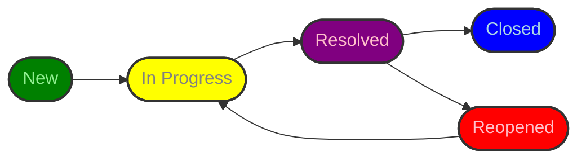

# Defect Management Process

- [Defect Management Process](#defect-management-process)
  - [1. Defect Identification](#1-defect-identification)
    - [1.1 Objective](#11-objective)
    - [1.2 Detection Methods](#12-detection-methods)
    - [1.3 Tools](#13-tools)
  - [2. Defect Logging](#2-defect-logging)
    - [2.1 Objective](#21-objective)
    - [2.2 Required Fields](#22-required-fields)
  - [3. Defect Triage](#3-defect-triage)
    - [3.1 Objective](#31-objective)
    - [3.2 Process](#32-process)
    - [3.3 Participants](#33-participants)
    - [3.4 Triage Cadence](#34-triage-cadence)
  - [4. Defect Assignment](#4-defect-assignment)
    - [4.1 Objective](#41-objective)
    - [4.2 Guidelines](#42-guidelines)
    - [4.3 Tools](#43-tools)
  - [5. Defect Resolution](#5-defect-resolution)
    - [5.1 Objective](#51-objective)
    - [5.2 Steps](#52-steps)
  - [6. Defect Verification](#6-defect-verification)
    - [6.1 Objective](#61-objective)
    - [6.2 Verification Steps](#62-verification-steps)
    - [6.3 Verification Criteria](#63-verification-criteria)
  - [7. Defect Closure](#7-defect-closure)
    - [7.1 Objective](#71-objective)
    - [7.2 Closure Steps](#72-closure-steps)
    - [7.3 Status Transitions](#73-status-transitions)
  - [8. Defect Reporting And Metrics](#8-defect-reporting-and-metrics)
    - [8.1 Objective](#81-objective)
    - [8.2 Key Metrics](#82-key-metrics)
    - [8.3 Tools](#83-tools)
  - [9. Continuous Improvement](#9-continuous-improvement)
    - [9.1 Objective](#91-objective)
    - [9.2 Actions](#92-actions)
  - [10. Additional Considerations](#10-additional-considerations)

## 1. Defect Identification

### 1.1 Objective

Identify and document defects throughout the software development lifecycle (SDLC) to ensure they are addressed efficiently.

### 1.2 Detection Methods

**Automated Testing:** CI/CD pipelines, unit tests, integration tests.
**Manual Testing:** Exploratory, functional, regression, and UAT testing.

### 1.3 Tools

**GitHub Issues** for tracking and reporting.
**Mocha** and **Selenium** for automated test detection.

## 2. Defect Logging

### 2.1 Objective

Ensure defects are logged with sufficient detail to enable quick analysis and resolution.

### 2.2 Required Fields

| Field                       | Description                                                       |
| --------------------------- | ----------------------------------------------------------------- |
| Defect ID                   | Auto-generated unique identifier.                                 |
| Title                       | Clear and concise summary.                                        |
| Description                 | Detailed explanation of the issue.                                |
| Steps to Reproduce          | Precise steps to replicate the defect.                            |
| Expected vs Actual Behavior | What should happen vs what actually happens.                      |
| Severity & Priority         | Severity (Critical, High, Medium, Low) and Priority (P1, P2, P3). |
| Environment Details         | OS, browser, version, test environment.                           |
| Attachments                 | Screenshots, logs, video recordings.                              |
| Reporter                    | Person or system logging the defect.                              |

## 3. Defect Triage

### 3.1 Objective

Review, prioritize, and assign defects to ensure efficient resolution.

### 3.2 Process

1. Analyze defects for validity, duplication, and reproducibility.
2. Determine severity & priority based on business and technical impact.
3. Label and categorize for efficient tracking (e.g., "UI Bug", "Security", "Performance").
4. Assign defects to the appropriate team or developer.
5. Estimate resolution timeline and track sprint inclusion.

### 3.3 Participants

| Role             | Responsibilities                                        |
| ---------------- | ------------------------------------------------------- |
| QA Engineers     | Log defects, verify, and prioritize.                    |
| Developers       | Fix defects, link commits, and verify fixes.            |
| Product Owners   | Review and prioritize defects based on business impact. |
| Project Managers | Track defect resolution and ensure timely delivery.     |

### 3.4 Triage Cadence

- Daily for critical defects.
- Sprint-based triage for planned work.
- Post-release review for production defects.

## 4. Defect Assignment

### 4.1 Objective

Assign defects to the appropriate team or individual based on expertise and workload.

### 4.2 Guidelines

✔ Assign frontend bugs to UI devs, backend issues to API devs, etc. 
✔ Use GitHub project boards to track developer workload. 
✔ Include testers for verification after resolution.

### 4.3 Tools

**GitHub Issues** for direct assignments.
**Slack notifications** for real-time defect updates.

## 5. Defect Resolution

### 5.1 Objective

Ensure defects are fixed properly and efficiently with minimal risk to existing functionality.

### 5.2 Steps

1. Analyze root causes (code review, logs, reproduction).
2. Develop and test the fix in a feature branch.
3. Link commits to the defect in GitHub.
4. Perform unit testing to validate the fix.
5. Create a pull request (PR) and request a peer review.
6. Merge only after passing CI/CD pipelines.

✔ Follow coding standards and PR guidelines. 
✔ Include regression tests to prevent recurrence.

## 6. Defect Verification

### 6.1 Objective

Validate that the defect is fixed and has not introduced regressions.

### 6.2 Verification Steps

1. Reproduce the original issue using logged steps.
2. Test the fix in the target environment (staging, test).
3. Run automated and manual tests to check for side effects.
4. Update defect status to "Resolved" if fixed, or "Reopened" if not.

### 6.3 Verification Criteria

✔ The fix matches the expected behavior. 
✔ No new defects or regressions were introduced. 
✔ Test automation updated if needed.

## 7. Defect Closure

### 7.1 Objective

Ensure defects are properly closed with documented verification.

### 7.2 Closure Steps

1. Close the defect only after successful verification.
2. Add a closure note summarizing the resolution.
3. Update linked test cases and documentation.

### 7.3 Status Transitions

**Open → In Progress → Resolved → Closed** 
If a defect fails verification: **Resolved → Reopened → In Progress**

## 8. Defect Reporting And Metrics

### 8.1 Objective

Track defect trends and improve overall software quality.

### 8.2 Key Metrics

| Metric                         | Formula                                   | Purpose                                         |
| ------------------------------ | ----------------------------------------- | ----------------------------------------------- |
| **Defect Density**             | Total defects / KLOC                      | Measures defect volume per 1,000 lines of code. |
| **Defect Leakage Rate**        | (Prod defects / Total defects) × 100%     | Tracks escaped defects.                         |
| **MTTR (Mean Time to Repair)** | Total resolution time / Number of defects | Measures average time to fix defects.           |
| **Defect Aging**               | Days open                                 | Identifies stale defects.                       |
| **Reopen Rate**                | (Reopened defects / Total defects) × 100% | Measures effectiveness of fixes.                |

### 8.3 Tools

- **GitHub Insights**/**Project** for defect tracking.
- **Slack**/**Email** alerts for real-time defect status updates.
- **Review metrics** in retrospectives to improve quality.
- Set **SLAs** for defect resolution to meet business needs.

## 9. Continuous Improvement

### 9.1 Objective

Leverage defect analysis to enhance development and testing processes.

### 9.2 Actions

- Conduct retrospectives after major releases.
- Analyze root causes of high-severity defects.
- Refine test strategies based on defect patterns.
- Optimize CI/CD pipelines to catch defects earlier.
- Enhance automation coverage to reduce manual testing efforts.

## 10. Additional Considerations

- **Workflow Customization**: Define and document your defect management workflow, including states, transitions, and responsibilities.
- **Test Case Management**: Integrate a test management tool for handling test cases.
- **Automated Testing**: Plan your CI/CD pipeline and integrate automated testing tools.
- **Risk Management**: Document and track risks separately.
- **Resource Management**: Use project management tools to plan and track resource allocation.
- **Documentation**: Maintain comprehensive documentation in a dedicated system and link relevant documentation to issues.
