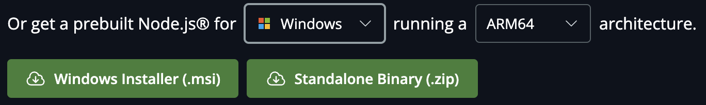
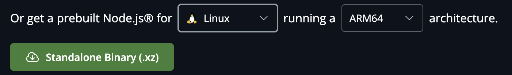

# Technical Specifications - Web FPGA

This project was requested by [ALGOSUP](https://algosup.com), a French computer science school.

<!-- This project aims to create a quick pathfinding<sup><a href="#1">[1]</a></sup> server according to a CSV<sup><a href="#1">[2]</a></sup> file of USA-roads. -->

<details>
<summary>Table Of Contents</summary>

- [Introduction](#introduction)
    - [Overview](#overview)
    - [In-Scope](#in-scope)
    - [Out Of Scope](#out-of-scope)
    - [Expected Deliverables](#expected-deliverables)
- [Documents And File Architectures](#documents-and-file-architectures)
    - [Documents Structure](#documents-structure)
    - [Code Structure](#code-structure)
- [Hardware](#hardware)
- [Technical Requirements](#technical-requirements)
<!-- - [Data Management](#data-management)
    - [Data Models](#data-models)
    - [Local Storage](#local-storage) -->
- [User Interface Design](#user-interface-design)
    - [UI Components](#ui-components)
    - [Themes And Styles](#themes-and-styles)
- [Integration And Environment](#integration-and-environment)
    - [Continuous Integration](#continuous-integration)
    - [Environment Configuration](#environment-configuration)
        - [VSCode Installation](#vscode-installation)
        - [NPM Installation](#npm-installation)
        - [Node.JS Installation](#nodejs-installation)
        - [React.JS Installation](#reactjs-installation)
        - [D3.JS Installation](#d3js-installation)
        - [Vite Installation](#vite-installation)
- [Maintenance And Support](#maintenance-and-support)
    - [Bug Reporting And Tracking](#bug-reporting-and-tracking)
    - [Updates And Upgrades](#updates-and-upgrades)
- [Glossary](#glossary)
- [References](#references)
    
</details>

## Introduction

### Overview

The aim of this project is to develop a web-based interface for an FPGA simulator that will be used for educational purposes. \ 
The interface will provide students and teachers with a visualization of FPGA signal propagation in real-time. It will integrate tools for synthesis, place and route (P&R), and timing simulation to offer a comprehensive learning experience. 

### In-Scope

All of the following points are in-scope objectives that should be completed before the end of the project, which will be on the first of April:

- The web-page should contain a 2D representation of the simulation made by the customer program.
- The web-page should represent all BEL utilization and signal routing, synchronized with time during the simulation process.
- The user should be able to pause, resume, advance and return in time.
- The clock cycles should be visible within the interface.
- Application examples should be loaded beforehand thanks to a parser created by our team and the sdf file given by the customer.
- The "teacher" user should be able to create a new application within the web-page.

### Out Of Scope

All of the understated points are out-of-scope and therefore irrelevant for this project:

- Creating a fully operated back-end.
- Creating our own simulator of an FPGA board.
- Representing the entire board during the simulation.
- Creating a loggin page.
- Using a deployment strategy.

### Expected Deliverables

This project has one main deliverable which is the web-page with a fully functional interface, preloaded examples with their own visualization schemes. However, the team would have to provide a parser with the functional interface in order to create any new applications in the future. \
All of these would be delivered before the first of April, which is the last deadline and end date of this project.

## Documents And File Architectures

All these architectures should follow the naming conventions written down in the [conventions.md](./conventions.md) file.

### Documents Structure

The structure showed below would allow team members to access every file quickly and efficiently. Therefore, all of the team members should follow this structure and ask for any adjustment if needed.

```md
2024-2025-project-4-web-fpga-team-5
├─── .github
├─── backend
├─── documents
│   ├─── functional
│   │   ├─── (other files...)
│   │   └─── functionalSpecifications.md
│   ├─── management
│   │   ├─── weeklyReports
│   │   │   ├─── cumulative.md
│   │   │   ├─── weeklyReport1.md
│   │   │   ├─── weeklyReport2.md
│   │   │   ├─── weeklyReport3.md
│   │   │   ├─── weeklyReport4.md
│   │   │   ├─── weeklyReport5.md
│   │   │   └─── weeklyReport6.md
│   │   ├─── (other files...)
│   │   ├─── projectCharter.md
│   │   └─── managementArtifacts.md
│   ├─── manual
│   │   ├─── (other files...)
│   │   ├─── userManual.pdf
│   │   └─── userManual.md
│   ├─── qualityAssurance
│   │   ├─── (other files...)
│   │   ├─── testCases.md
│   │   ├─── testPlan.md
│   │   └─── defectManagementProcess.md
│   └─── technical
│       ├─── (other files...)
│       ├─── conventions.md
│       └─── technicalSpecifications.md
├─── frontend
├─── .gitignore
└─── README.md
```

### Code Structure

Concerning the code structure, it would be parted in two different folders:
- the first one would be dedicated to the backend;
- while the second one would be for the frontend.

By following these conventions, every one exterior to the project team 5 would be able to catch up quite easily and to find every information needed fpr their own advancement.

Once again. This list has been made in amount of the project. Therefore, it is meant to change in the following weeks if a better structure or a new idea shoudl be implemented to the repository/structure. Eventually, these changes would be described in the following tree or in a sub category to keep catch of the first arrangement.

```md
2024-2025-project-4-web-fpga-team-5
├─── backend
│   ├─── test
│   │   ├─── (all the backend test files would be stored in this folder)
│   │   └─── sdfProccess.test.js
│   ├─── sdfFiles
│   │   ├─── FF1PostSynthesis.json
│   │   ├─── FF1NorstPostSynthesis.json
│   │   ├─── FF2PostSynthesis.json
│   │   ├─── FF2NorstPostSynthesis.json
│   │   ├─── RisingEdgeDFlipFlopAsyncResetHighPostSynthesis.json
│   │   ├─── FULLLUTPostSynthesis.json
│   │   ├─── LUTPostSynthesis.json
│   │   └─── (all other applications will be listed there)
│   ├─── src
│   │   └─── sdfProccess.js
│   ├─── index.js
│   ├─── package-lock.json
│   └─── package.json 
├─── frontend
│   ├─── test
│   │   ├─── (all the frontend test files would be stored in this folder)
│   │   ├─── app.test.jsx
│   │   └─── main.test.jsx
│   ├─── public
│   │   └─── (assets than can be public, e.g. svg, jpeg, etc.)
│   ├─── src
│   │   ├─── assets
│   │   │   └─── (assets that can't be accessed publicly.)
│   │   ├─── app.css
│   │   ├─── app.jsx
│   │   ├─── index.css
│   │   └─── main.jsx
│   ├─── eslint.config.js
│   ├─── index.html
│   ├─── package-lock.json
│   └─── package.json 
```

## Hardware

These are all the hardware we'll use to develop the project:

- [**Apple MacBook Air - M3 10-core GPU**](https://www.apple.com/fr/shop/buy-mac/macbook-air/13-pouces-m3)
  - 13.6 inch (2560 x 1664)
  - RAM: 16.0 GB
  - macOS Ventura 13.0
  - Apple M3 Chip
  - Qwerty keyboard

- [**Lenovo Thinkbook 14**](https://pcsupport.lenovo.com/us/en/products/laptops-and-netbooks/thinkbook-series/thinkbook-14-iil/20sl)
  - Windows 11 Pro
  - 14-inch (1920 x 1080)
  - Processor: Intel(R) Core(TM) i7-1065G7 CPU @ 1.30GHz
  - RAM: 16.0 GB
  - System type: 64-bit operating system, x64-based processor

## Technical Requirements

<!-- TODO: Making graph for flow and applications -->

<!-- ## Data Management -->

<!-- ### Data Models -->

<!-- TODO -->

<!-- ### Local Storage -->

<!-- TODO -->

## User Interface Design

### UI Components

All the UI Components have been predesigned in a mock-up to help the development part of the application. The softwre development team will just have to look on the mock-up and to follow each instruction to reproduce an apllication similar to our ideal mock-up.

Moreover, this mock-uo has been iterated many times according to the client preferences. Therefore, it shouldn't be changed in the following days or in a near future.

You can find the different aspect at these two places:
- [The Functinal Specifications](../functional/functionalSpecifications.md)
- [The Application Mock-up](https://www.figma.com/design/YohFQNPfGWHBlULNmWJFgS/WebFPGA?node-id=0-1&p=f&t=iZloJbAbCTv3OLB5-0)

### Themes And Styles

Regarding the themes of the application. At the launch of the product, only the light mode will be created, since toggling themes aren't a priority in our application. \
However, on a future update, this feature would be implemented. To do so, the development team would use the `color-scheme` attributes.
It could be use as in the example below: \
**The CSS part:**
```CSS
:root {
    color-scheme: light dark; /* light dark means it supports both light and dark mode */
    --bg-color: white;
    --text-color: black;
}

body {
    background-color: var(--bg-color);
    color: var(--text-color);
}

.dark-mode {
    --bg-color: black;
    --text-color: white;
}
```
**The JS part:**
```JS
function toggleTheme() {
    document.body.classList.toggle('dark-mode');
}
```

## Integration And Environment

### Continuous Integration

For this project, the development team would use a continuous integration. Which means they would add new features regularly to the codebase in order to have a progression line more important than just by adding everything at the really end.

The continuous integration will mainly be held by GitHub and the repository, allowing all the team members to create branches and work simultaneously on different parts of the code.

The merge and pull request would be done regularly with a check by the quality assurance before any of the pull requests to the dev and main branches. It would avoid stress by pushing a wrong version in the main branch but would also highly enhance the code quality.

### Environment Configuration

To achieve this project, you would need:
- VSCode 1.77 or later
- Node.JS
- React.JS
- D3.JS
- Vite (optional)

#### VSCode Installation

To install VSCode, you can follow these steps:
1. Download the VS Code file from the [Official Website](https://code.visualstudio.com/docs/setup/setup-overview).
2. Execute the download file.
3. Accept the Terms & Conditions.
4. Click on the Install button.
5. Wait for the installation to complete.
6. Click on the Launch button to start it.

If you already have VSCode installed on your machine, you can check for any updates by going to: 
- On Windows and Linux: \
``Help > Check for Updates``
- On macOS: \
``Code > Check for Updates``

#### NPM Installation

Before utilizing Node.JS or any libraries/frameworks from JavaScript, it is recommended to install NPM. \
To install NPM run the following command line:

```cmd
npm install -g npm
```

That's all. However, you can check if you already have it installed on your machine by running the underneath command line:

```cmd
npm -v
```

#### Node.JS Installation

Installing Node.JS depends on your browser, therefore, precise your operating system pefore downloading the package in the [official website](https://nodejs.org/en/download).

| Operating System | Illustration                                                                              |
| ---------------- | ----------------------------------------------------------------------------------------- |
| MacOS            |      |
| Windows          |  |
| Linux            |      |

Some VSCode extensions that could be useful:
- *Search node_modules*
- *node-snippets*
- *Node Essentials*

#### **React.JS Installation**

There are two ways of installing React.JS. The first one is by using CRA while the second needs [Vite](#vite-installation).

*By Using CRA*

1. Open your command prompt window, then navigate to your repository.
2. Create the folder that will contain your repository, then navigate through it.
3. Run: `npx create-react-app [project name of your choice]`.

Well done, you created your repository in React.JS by using CRA.

*By Using Vite*

1. Open your command prompt window, then navigate to your repository.
2. Create the folder that will contain your repository, then navigate through it.
3. Run: `npm create vite@latest [your project name]`.
4. Select React by using your `arrow keys`, then click `enter`.
5. Select JavaScript by using your `arrow keys`, then click `enter`.
6. Follow the command prompt window's instructions.
7. Run: `npm install`.

Well done, you created your repository in React.JS by using Vite.

Some VSCode extensions that could be useful:
- *Simple React Snippets*
- *ES7+ React/Redux/React-Native snippets*
- *React Native Tools*

#### D3.JS Installation

To install D3 you could follow the installation guide in their [official website](https://d3js.org/getting-started).

1. Open your command prompt window, then navigate to your repository.
2. Create the folder that will contain your repository, then navigate through it.
3. Run: `npm install d3`.

Once you have installed d3, you should import it in your own files. \
You can then load D3 into your app as:

```js
import * as d3 from "d3";
```

You can instead import specific symbols if you prefer:

```js
import {select, selectAll} from "d3";
```

Alternatively you can install and import from D3 submodules:

```js
import {mean, median} from "d3-array";
```

Some VSCode extensions that could be useful:
- *D3.js Snippets*
- *D3.js code snippets*

#### Vite Installation

You can follow these instruction on the [official website](https://vite.dev/guide/).

In your project, you can install the vite CLI using:

```npm
$ npm install -D vite
```

And create an `index.html` file like this:

```
<p>Hello Vite!</p>
```

Then run the appropriate CLI command in your terminal:


```npm
$ npx vite
```

## Maintenance And Support

### Bug Reporting And Tracking

To handle all the errors, the development team would neeed to create unit test to ensure the code is bug-free. Therefore, a new folder would be created in the `frontend` and `backend` folders. It would be called test and will contain all the test files. There would be one testinf file for every file in the application. They would be named with a `.test` at the end of the file name.

Example:
```
/lib -> app.jsx

would become

/test -> app.test.jsx
```

To create those unit tests, the development team would use Jest. They would need to modify the following files accordingly:

- Downloading the necesary library:
```
npm install @testing-library/jest-dom --save-dev
npm install @testing-library/react --save-dev
```

- Importing the libraries in all of the testing files:
```JS
import '@testing-library/jest-dom';
import '@testing-library/jest-dom/extend-expect';
```

- Modify the `package.json` file:
```
"scripts": {
    "test": "react-scripts test --watchAll --coverage"
},
```

Here is an example of a unit test:
```JSX
import { render, screen } from '@testing-library/react'
import FirstTest from '../components/FirstTest';

test("Example 1 renders successfully", () => {
    render(<FirstTest/>);

    const element = screen.getByText(/first test/i);

    expect(element).toBeInTheDocument();
})
```

For further information, please refer to the [test plan](../qualityAssurance/testPlan.md).

### Updates And Upgrades

As this project only has six weeks in lenght for us, ALGOSUP students. Every push, or pull request made after the end date, which is the first of April, would be considered as an update. 

Our team will do its best to complete all the requirements in time, in that case, every features not required for this project but approved by the customer would be considered as an upgrade.

## Glossary

<!-- TODO -->

## References

<!-- TODO -->