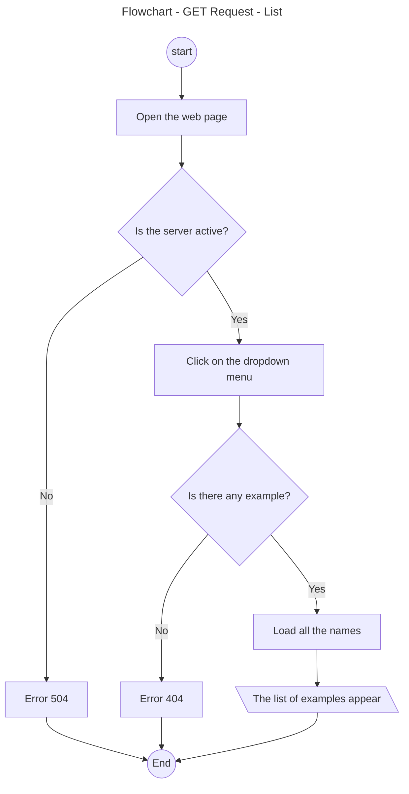
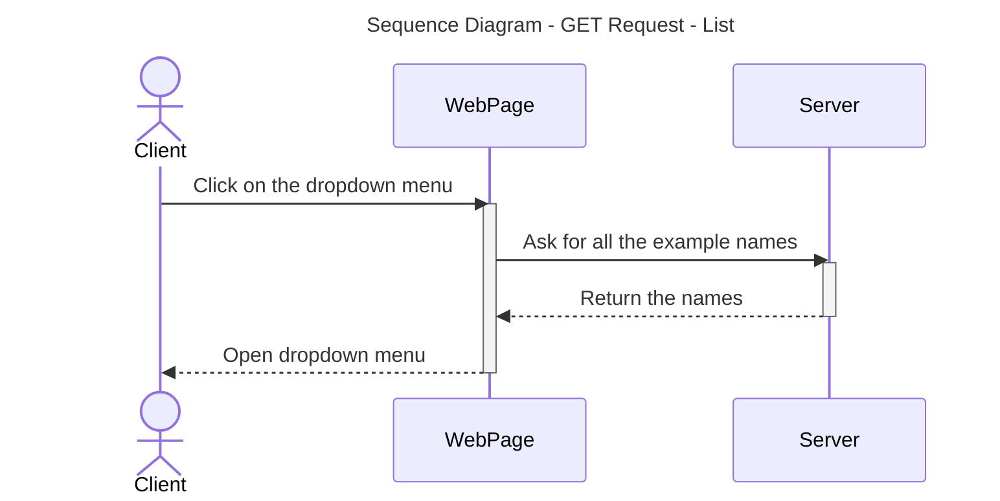
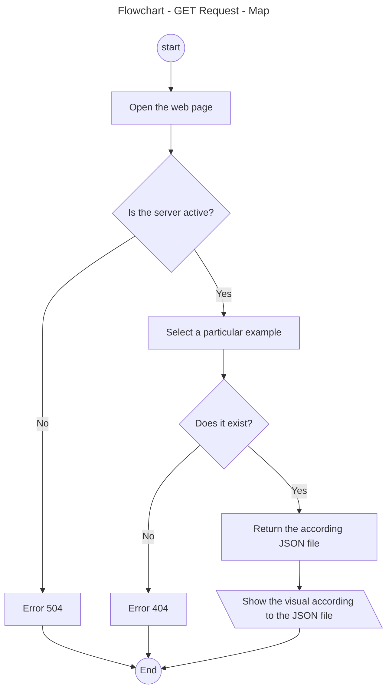
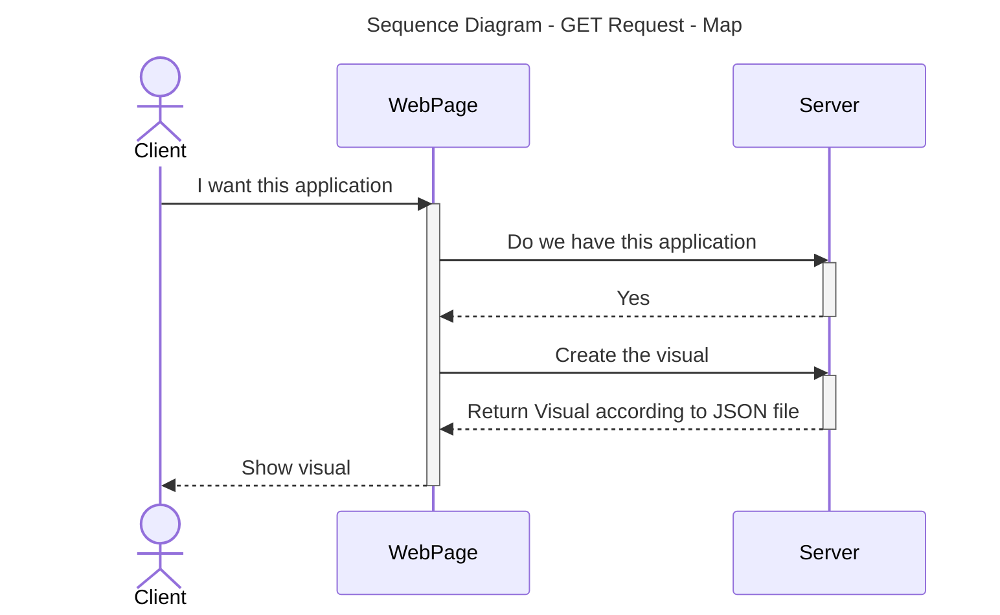
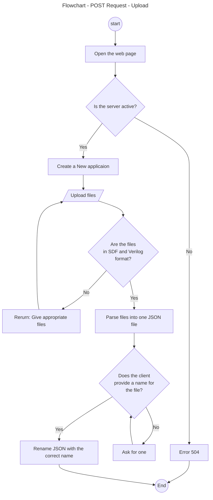
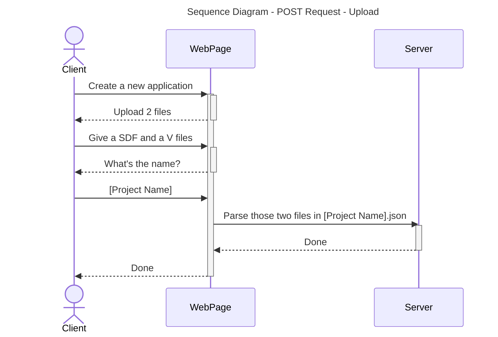
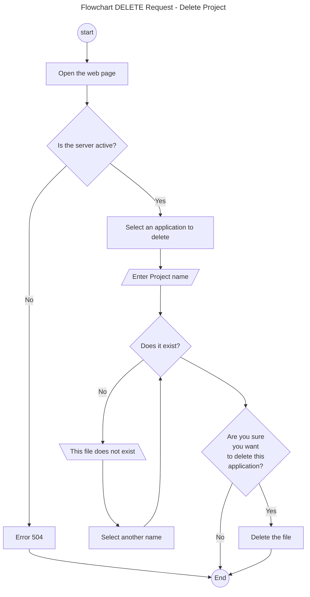
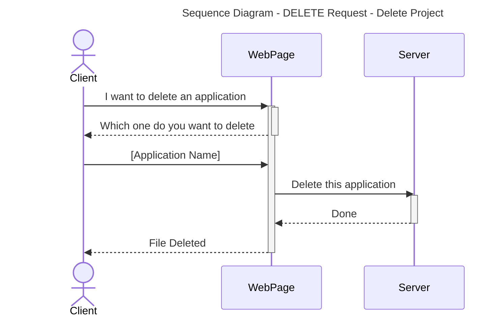

# Technical Specifications - Web FPGA

This project was requested by [ALGOSUP](https://algosup.com), a French computer science school.

<details>
<summary>Table Of Contents</summary>

- [Introduction](#introduction)
  - [Overview](#overview)
  - [In-Scope](#in-scope)
  - [Out Of Scope](#out-of-scope)
  - [Expected Deliverables](#expected-deliverables)
- [Documents And File Architectures](#documents-and-file-architectures)
  - [Documents Structure](#documents-structure)
  - [Code Structure](#code-structure)
- [Hardware](#hardware)
- [Technical Requirements](#technical-requirements)
  - [Diagrams](#diagrams)
    - [List](#list)
    - [Map](#map)
    - [Upload](#upload)
    - [Delete](#delete)
  - [Languages](#languages)
    - [Front-End](#front-end)
    - [Back-End](#back-end)
  - [Versioning](#versioning)
  - [Server](#server)
    - [Endpoints](#endpoints)
  - [Data Management](#data-management)
    - [Local Storage](#local-storage)
    - [Creation Of Applications](#creation-of-applications)
    - [Data Security](#data-security)
    - [Data Integrity](#data-integrity)
- [User Interface Design](#user-interface-design)
  - [UI Components](#ui-components)
  - [Themes And Styles](#themes-and-styles)
- [Integration And Environment](#integration-and-environment)
  - [Continuous Integration](#continuous-integration)
  - [Environment Configuration](#environment-configuration)
    - [VSCode Installation](#vscode-installation)
    - [NPM Installation](#npm-installation)
    - [Node.JS Installation](#nodejs-installation)
    - [Express.JS Installation](#expressjs-installation)
    - [React.JS Installation](#reactjs-installation)
    - [Tailwind CSS Installation](#tailwind-css-installation)
    - [D3.JS Installation](#d3js-installation)
    - [Vite Installation](#vite-installation)
- [Maintenance And Support](#maintenance-and-support)
  - [Bug Reporting And Tracking](#bug-reporting-and-tracking)
  - [Updates And Upgrades](#updates-and-upgrades)
- [Glossary](#glossary)
- [References](#references)

</details>

## Introduction

### Overview

The aim of this project is to develop a web-based interface for an FPGA<sup><a id="1-bis" href="#1">[1]</a></sup> simulator that will be used for educational purposes. \
The interface will provide students and teachers with a visualization of FPGA signal propagation in real-time. It will integrate tools for synthesis, place and route (P&R)<sup><a id="2-bis" href="#2">[2]</a></sup>, and timing simulation to offer a comprehensive learning experience.

### In-Scope

All of the following points are in-scope objectives that should be completed before the end of the project, which will be on the first of April:

- The web-page should contain a 2D representation of the simulation made by the customer program.
- The web-page should represent all BEL<sup><a id="3-bis" href="#3">[3]</a></sup> utilization and signal routing, synchronized with time during the simulation process.
- The user should be able to pause, resume, advance and return in time.
- The clock cycles<sup><a id="4-bis" href="#4">[4]</a></sup> should be visible within the interface.
- Application examples should be loaded beforehand thanks to a parser<sup><a id="5-bis" href="#5">[5]</a></sup> created by our team and the sdf file<sup><a id="6-bis" href="#6">[6]</a></sup> given by the customer.
- The "teacher" user should be able to create a new application within the web-page.

### Out Of Scope

All of the understated points are out-of-scope and therefore irrelevant for this project:

- Creating a fully operated back-end.
- Creating our own simulator of an FPGA board.
- Representing the entire board during the simulation.
- Creating a loggin page.
- Using a deployment strategy.
- Making the page scalable for smartphones.

### Expected Deliverables

This project has one main deliverable which is the web-page with a fully functional interface, preloaded examples with their own visualization schemes. However, the team would have to provide a parser with the functional interface in order to create any new applications in the future. \
All of these would be delivered before the first of April, which is the last deadline and end date of this project.

## Documents And File Architectures

All these architectures should follow the naming conventions written down in the [conventions.md](./conventions.md) file.

### Documents Structure

The structure showed below would allow team members to access every file quickly and efficiently. Therefore, all of the team members should follow this structure and ask for any adjustment if needed.

```md
2024-2025-project-4-web-fpga-team-5
├─── .github
├─── backend
├─── documents
│   ├─── functional
│   │   ├─── (other files...)
│   │   └─── functionalSpecifications.md
│   ├─── management
│   │   ├─── weeklyReports
│   │   │   ├─── cumulative.md
│   │   │   ├─── weeklyReport1.md
│   │   │   ├─── weeklyReport2.md
│   │   │   ├─── weeklyReport3.md
│   │   │   ├─── weeklyReport4.md
│   │   │   ├─── weeklyReport5.md
│   │   │   └─── weeklyReport6.md
│   │   ├─── (other files...)
│   │   ├─── projectCharter.md
│   │   └─── managementArtifacts.md
│   ├─── manual
│   │   ├─── (other files...)
│   │   ├─── userManual.pdf
│   │   └─── userManual.md
│   ├─── qualityAssurance
│   │   ├─── (other files...)
│   │   ├─── testCases.md
│   │   ├─── testPlan.md
│   │   └─── defectManagementProcess.md
│   └─── technical
│       ├─── (other files...)
│       ├─── conventions.md
│       └─── technicalSpecifications.md
├─── frontend
├─── images
├─── .gitignore
└─── README.md
```

### Code Structure

Concerning the code structure, it would be parted in two different folders:

- the first one would be dedicated to the back-end;
- while the second one would be for the front-end.

By following these conventions, every exterior people of the team 5 project would be able to catch up quite easily and to find every information needed for their own advancement.

Once again. This list has been made in amount of the project. Therefore, it is meant to change in the following weeks if a better structure or a new idea should be implemented to the repository/structure. Eventually, these changes would be described in the following tree or in a sub category to keep catch of the first arrangement.

```md
2024-2025-project-4-web-fpga-team-5
├─── backend
│   ├─── test
│   │   ├─── (all the backend test files would be stored in this folder)
│   │   └─── sdfProccess.test.js
│   ├─── sdfFiles
│   │   ├─── FF1PostSynthesis.json
│   │   ├─── FF1NorstPostSynthesis.json
│   │   ├─── FF2PostSynthesis.json
│   │   ├─── FF2NorstPostSynthesis.json
│   │   ├─── RisingEdgeDFlipFlopAsyncResetHighPostSynthesis.json
│   │   ├─── FULLLUTPostSynthesis.json
│   │   ├─── LUTPostSynthesis.json
│   │   └─── (all other applications will be listed there)
│   ├─── src
│   │   └─── sdfProccess.js
│   ├─── index.js
│   ├─── package-lock.json
│   └─── package.json 
├─── frontend
│   ├─── test
│   │   ├─── (all the frontend test files would be stored in this folder)
│   │   ├─── app.test.jsx
│   │   └─── main.test.jsx
│   ├─── public
│   │   └─── (assets than can be public, e.g. svg, jpeg, etc.)
│   ├─── src
│   │   ├─── assets
│   │   │   └─── (assets that can't be accessed publicly.)
│   │   ├─── app.css
│   │   ├─── app.jsx
│   │   ├─── index.css
│   │   └─── main.jsx
│   ├─── eslint.config.js
│   ├─── index.html
│   ├─── package-lock.json
│   └─── package.json 
```

## Hardware

These are all the hardware we'll use to develop the project:

- [**Apple MacBook Air - M3 10-core GPU**](https://www.apple.com/fr/shop/buy-mac/macbook-air/13-pouces-m3)
  - 13.6 inch (2560 x 1664)
  - RAM: 16.0 GB
  - macOS Ventura 13.0
  - Apple M3 Chip
  - Qwerty keyboard

- [**Lenovo Thinkbook 14**](https://pcsupport.lenovo.com/us/en/products/laptops-and-netbooks/thinkbook-series/thinkbook-14-iil/20sl)
  - Windows 11 Pro
  - 14-inch (1920 x 1080)
  - Processor: Intel(R) Core(TM) i7-1065G7 CPU @ 1.30GHz
  - RAM: 16.0 GB
  - System type: 64-bit operating system, x64-based processor

## Technical Requirements

### Diagrams

<!-- TODO: Making graph for flow and applications -->
#### List



---



#### Map



---



#### Upload



---



#### Delete



---



### Languages

This project has no language requirement. Therefore, our team was free to chose the language that would suits the best our needs.

#### Front-End

To complete this project, the team has to create a webpage for the customer. To do so, it was set to use React.JS<sup><a id="7-bis" href="#7">[7]</a></sup>, which is a framework of JavaScript<sup><a id="8-bis" href="#8">[8]</a></sup>, a language used in the web development.

React.JS was chosed for these numerous advantages:

- **Fast & Efficient**: Uses a declarative approach, leading to better performance and maintainability.
- **Strong Community Support**: Backed by Facebook and a vast open-source community.
- **Easy to Learn**: Especially for developers familiar with JavaScript and JSX.
- **Cross-Platform Development**: Can be used for mobile apps via React Native.

Unfortunately, React.JS has its share of flaws:

- **Poor Documentation**: Due to rapid updates, some features lack up-to-date documentation.
- **Heavy Initial Load**: The React library itself can add to the initial bundle size.
- **Too Many Choices**: Various ways to structure projects (Hooks, Context API, Redux, etc.) can be overwhelming.

However, we judge it suitable for our product and decided to went along with it.

Finally, we also thought of another library for the visualization part, which is D3.JS<sup><a id="9-bis" href="#9">[9]</a></sup>. The development team would mainly use it for it's user-friendly approach of UI features such as Zoom in/out.

Advantages:

- **Powerful Data Visualization**: Allows for highly customizable and interactive charts, graphs, and visualizations.
- **Rich Animation & Interactivity**: Uses built-in transitions and event listeners for dynamic UI.
- **Extensive Community & Resources**: Strong support from developers and a wide range of tutorials.
- **No Dependencies**: A pure JavaScript library that doesn’t rely on external frameworks.

Drawbacks:

- **Steep Learning Curve**: Requires understanding of SVG, JavaScript, and functional programming concepts.
- **Performance Issues**: Can be slow for extremely large datasets if not optimized properly.
- **Not a Full-Fledged Framework**: Unlike React or Angular, D3.js is just a visualization library, requiring integration with other tools for complex applications.
- **Mobile Responsiveness Needs Manual Handling**: Unlike some modern charting libraries, D3 requires explicit coding for responsiveness.

#### Back-End

Concerning the back-end, the choice has been made to keep it simple and to use Node.JS<sup><a id="10-bis" href="#10">[10]</a></sup> and Express.JS<sup><a id="11-bis" href="#11">[11]</a></sup> which are world wide spread. \
Here are some pros and cons about Node.JS:

Node.JS advantages:

- **Fast Performance**: Built on Google’s V8 engine, making it highly efficient for I/O operations.
- **Large Ecosystem (NPM)**: Offers thousands of open-source packages to speed up development.
- **Cross-Platform Compatibility**: Runs on Windows, Linux, and macOS.
- **Active Community**: Backed by a large developer community and enterprise support.

Node.JS flaws:

- **Callback Hell**: Complex nesting of callbacks can make code harder to manage (mitigated with Promises and async/await).
- **Heavy Dependency on Third-Party Modules**: Many features require external libraries, increasing potential security risks.

And here are those for Express.JS:

Express.JS advantages:

- **Minimal & Lightweight**: A fast, unopinionated framework that provides only essential features.
- **Easy to Learn**: Simple syntax and structure make it beginner-friendly.
- **Flexible**: Does not enforce any specific project structure, allowing developers to build as they prefer.

Express.JS drawbacks:

- **Callback Hell**: Can lead to deeply nested callbacks if not handled properly (mitigated with async/await or Promises).
- **Not Ideal for Large-Scale Apps Alone**: Lacks built-in solutions for scalability, requiring additional tools like Nest.js or frameworks like Next.js.

### Versioning

For this project, the versioning has been defined has below:

| Ids       | Names          | Definitions                                                                                          |
| --------- | -------------- | ---------------------------------------------------------------------------------------------------- |
| <ins>**0**</ins>.0.0 | Major update   | This identifier will be used for the major update/product (0: before MVP; 1: MVP; 2: final product). |
| 0.<ins>**0**</ins>.0 | Feature update | This identifier will be the number of feature added after each major version of the product.         |
| 0.0.<ins>**0**</ins> | Fixes          | This identifier shows the number of fixes in between two major updates of the product.              |

>[!CAUTION]
> Increasing the major version indicator will reset the two other indicators.
> However, increasing the feature update indicator will not reset the fixes one.

### Server

This project required a webpage accessible easily on every operating system and even smaller devices, such as tablets. It also needs to store some basic applications (examples) for the customer to show to their client/user. Therefore, we decided to come up with a simple local host server<sup><a id="12-bis" href="#12">[12]</a></sup> to store all the data.

However, if there are servers, there should be endpoints<sup><a id="13-bis" href="#13">[13]</a></sup> to whom giving requests. These endpoints would be described furthermore in the following part. \
The development team will use Postman<sup><a id="14-bis" href="#14">[14]</a></sup> to test and develop these endpoints.

#### Endpoints

For this project, four endpoints have been designed for our server to accomplish its role. \
Here are listed all of the endpoints designed for this project:

- **GET**: `http://localhost:3001/api/list`
  - retrieving all the existing applications.
- **GET**: `http://localhost:3001/api/map/{filename}`
  - retriving a specific application.
- **POST**: `http://localhost:3001/api/upload`
  - updating an existing application.
- **DELETE**: `http://localhost:3001/api/delete/{filename}`
  - deleting an existing application. \
*{}: parameters*

All of these endpoints are more detailed in our [API Documentation](./APIDocumentation.md).

### Data Management

#### Local Storage

<!-- TODO: add small example of parsing -->
As previously mentioned in the [server](#server) part, we will be using a server with local host to store all of the predefined applications asked by the client.
You can find all of them at its repository: [ALGOSUP_POC](https://github.com/LeFl0w/ALGOSUP_POC/tree/main/Examples). \
However, these examples are for now under sdf and verilog<sup><a id="15-bis" href="#15">[15]</a></sup> format, which is not suitable for our application.

The development team has to create a parser that will translate these two files into one in JSON. It would be more suitable and convenient this way.

The parser would be coded in JavaScript and would follow the described logic you can find by clicking [this link](https://github.com/LeFl0w/ALGOSUP_POC/blob/main/Doc/SDF.md).

All of these application would be accessible directly within the application through a dropdown menu. You can learn more about it in the [Diagrams part](#diagrams).

Finally, the parsed files would keep the same name as the sdf and verilog ones, except it would be JSON<sup><a id="16-bis" href="#16">[16]</a></sup> files.

```Example
FF1_post_synthesis.sdf + FF1_post_synthesis.v

=> 

FF1PostSynthesis.json
```

#### Creation Of Applications

Another feature required by the customer was to create applications within the webpage. To create these applications, the user would have to click on an add button. This will trigger an event and the user would be able to drag and drop (or search from it's local storage) a sdf and verilog file.

>[!CAUTION]
> These two files are mandatory and needed to do the parsing and the creation of the application.
> If one of the two are missing, the application wouldn't be created.

If the two files don't have the same name, a default name would be given to the application (`newApplication1`).

Finally, to create an application, we still need to parse the files into a JSON file. However, we won't use the same parser as the first one will only serve as parsing the prerequisited examples made by the client at the launching of the server. \
Moreover, this parser would not send the data to the server but will keep them inside the repository in the `sdfFiles` folder.

#### Data Security

This project doesn't need a lot of data security. All of the project and examples are on public repository on GitHub since this project is a open source one. \
Moreover, we are using a locally hosted server, which means it couldn't be reached by bad-intentioned people on internet.

However, we still decided to put simple data security to avoid the webpage to be corrupted in an unexpected scenario.

The development team will mainly create a user input validation process on the server, avoiding bad requests and wrong creation of applications.

Here are some examples that could be implemented for the data security:

- File Security using `multer`:

```JS
const multer = require('multer');
const upload = multer({
  fileFilter: (req, file, cb) => {
    if (file.mimetype === 'image/png' || file.mimetype === 'image/jpeg') {
      cb(null, true);
    } else {
      cb(new Error('Invalid file type'), false);
    }
  },
});

app.post('/upload', upload.single('file'), (req, res) => {
  res.send('File uploaded successfully');
});
```

- Input Validation & Sanitization using `express-validator`:

```JS
const { body, validationResult } = require('express-validator');

app.post('/data', [
  body('username').isAlphanumeric().trim().escape(),
  body('email').isEmail().normalizeEmail(),
], (req, res) => {
  const errors = validationResult(req);
  if (!errors.isEmpty()) {
    return res.status(400).json({ errors: errors.array() });
  }
  res.send('Data is safe!');
});
```

#### Data Integrity

Data integrity is important in this project. Applications-created at the begining or later on-should always be the same and don't need to change while the server is running. \
To ensure there are no issues in this field, developers will have to create integrity check within the code source.

They could use the `Subresource Integrity` proposed by [mdn web docs](https://developer.mozilla.org/en-US/docs/Web/Security/Subresource_Integrity).

Finally, hashing could also be used to ensure the integrity of the files, here is an example of it using `crypto`:

```JS
const crypto = require('crypto');

function hashData(data) {
  return crypto.createHash('sha256').update(data).digest('hex');
}

app.post('/verifyData', (req, res) => {
  const originalHash = req.body.hash;
  const newHash = hashData(req.body.data);
  res.send(originalHash === newHash ? 'Data is intact' : 'Data has been tampered with');
});
```

## User Interface Design

### UI Components

All the UI Components have been predesigned in a mock-up<sup><a id="17-bis" href="#17">[17]</a></sup> to help the development part of the application. The software development team will just have to look on the mock-up and to follow each instruction to reproduce an application similar to our ideal mock-up.

Moreover, this mock-up has been iterated many times according to the client preferences. Therefore, it shouldn't be changed in the following days or in a near future.

You can find the different aspects at these two places:

- [The Functinal Specifications](../functional/functionalSpecifications.md)
- [The Application Mock-up](https://www.figma.com/design/YohFQNPfGWHBlULNmWJFgS/WebFPGA?node-id=0-1&p=f&t=iZloJbAbCTv3OLB5-0)

### Themes And Styles

Regarding the themes of the application. At the launch of the product, only the light mode will be created, since toggling themes aren't a priority in our application. \
However, on a future update, this feature would be implemented. To do so, the development team would use the `color-scheme` attributes.
It could be use as in the example below: \
**The CSS part:**

```CSS
:root {
    color-scheme: light dark; /* light dark means it supports both light and dark mode */
    --bg-color: white;
    --text-color: black;
}

body {
    background-color: var(--bg-color);
    color: var(--text-color);
}

.dark-mode {
    --bg-color: black;
    --text-color: white;
}
```

**The JS part:**

```JS
function toggleTheme() {
    document.body.classList.toggle('dark-mode');
}
```

## Integration And Environment

### Continuous Integration

For this project, the development team would use a continuous integration. Which means they would add new features regularly to the codebase in order to have a progression line more important than just by adding everything at the really end.

The continuous integration will mainly be held by GitHub and the repository, allowing all the team members to create branches and work simultaneously on different parts of the code.

The merge and pull request would be done regularly with a check by the quality assurance before any of the pull requests to the dev and main branches. It would avoid stressing out by pushing a wrong version in the main branch and would also highly enhance the code quality.

### Environment Configuration

To achieve this project, you would need:

- VSCode 1.77 or later
- NPM
- Node.JS
- Express.JS
- React.JS
- Tailwind CSS
- D3.JS
- Vite (optional)

#### VSCode Installation

To install VSCode, you can follow these steps:

1. Download the VS Code file from the [Official Website](https://code.visualstudio.com/docs/setup/setup-overview).
2. Execute the download file.
3. Accept the Terms & Conditions.
4. Click on the Install button.
5. Wait for the installation to complete.
6. Click on the Launch button to start it.

If you already have VSCode installed on your machine, you can check for any updates by going to:

- On Windows and Linux: \
``Help > Check for Updates``
- On macOS: \
``Code > Check for Updates``

#### NPM Installation

Before utilizing Node.JS or any libraries/frameworks from JavaScript, it is recommended to install NPM. \
To install NPM run the following command line:

```cmd
npm install -g npm
```

That's all. However, you can check if you already have it installed on your machine by running the underneath command line:

```cmd
npm -v
```

#### Node.JS Installation

Installing Node.JS depends on your browser, therefore, precise your operating system pefore downloading the package in the [official website](https://nodejs.org/en/download).

| Operating System | Illustration                                                                              |
| ---------------- | ----------------------------------------------------------------------------------------- |
| MacOS            |      |
| Windows          |  |
| Linux            |      |

Some VSCode extensions that could be useful:

- *Search node_modules*
- *node-snippets*
- *Node Essentials*

#### Express.JS Installation

To install Express.JS you need to have Node.JS already installed. You can refer to [this section](#nodejs-installation). You could follow the installation guide in the Express.JS [official website](https://expressjs.com/en/starter/installing.html).

1. Open your command prompt window, then navigate to your repository.
2. Create the folder that will contain your repository, then navigate through it.
3. Run: `npm install express`.

A VSCode extension that could be useful:

- *Express.js FastAPI Backend Snippets*

#### React.JS Installation

There are two ways of installing React.JS. The first one is by using CRA<sup><a id="18-bis" href="#18">[18]</a></sup> while the second needs [Vite](#vite-installation). \
*By Using CRA*

1. Open your command prompt window, then navigate to your repository.
2. Create the folder that will contain your repository, then navigate through it.
3. Run: `npx create-react-app [project name of your choice]`.

Well done, you created your repository in React.JS by using CRA. \
*By Using Vite*

1. Open your command prompt window, then navigate to your repository.
2. Create the folder that will contain your repository, then navigate through it.
3. Run: `npm create vite@latest [your project name]`.
4. Select React by using your `arrow keys`, then click `enter`.
5. Select JavaScript by using your `arrow keys`, then click `enter`.
6. Follow the command prompt window's instructions.
7. Run: `npm install`.

Well done, you created your repository in React.JS by using Vite.

Some VSCode extensions that could be useful:

- *Simple React Snippets*
- *ES7+ React/Redux/React-Native snippets*
- *React Native Tools*

#### Tailwind CSS Installation

To install Tailwind CSS you could follow the installation guide in their [official website](https://tailwindcss.com/docs/installation/using-vite).

To install Tailwind CSS using Vite:

1. Open your command prompt window, then navigate to your repository.
2. Create the folder that will contain your repository, then navigate through it.
3. Run: `npm install tailwindcss @tailwindcss/vite`.
4. Add the @tailwindcss/vite plugin to your Vite configuration.

```js
import { defineConfig } from 'vite'
import tailwindcss from '@tailwindcss/vite'
export default defineConfig({
  plugins: [
    tailwindcss(),
  ],
})
```

5. Import Tailwind in your CSS by writing: `@import "tailwindcss";`.
6. Import it in your HTML file with: `<link href="/src/styles.css" rel="stylesheet">` in the `<head>` section.

Some VSCode extensions that could be useful:

- *Tailwind CSS IntelliSense*
- *Tailwind Docs*
- *Tailwind Snippets*

#### D3.JS Installation

To install D3 you could follow the installation guide in their [official website](https://d3js.org/getting-started).

1. Open your command prompt window, then navigate to your repository.
2. Create the folder that will contain your repository, then navigate through it.
3. Run: `npm install d3`.

Once you have installed d3, you should import it in your own files. \
You can then load D3 into your app as:

```js
import * as d3 from "d3";
```

You can instead import specific symbols if you prefer:

```js
import {select, selectAll} from "d3";
```

Alternatively you can install and import from D3 submodules:

```js
import {mean, median} from "d3-array";
```

Some VSCode extensions that could be useful:

- *D3.js Snippets*
- *D3.js code snippets*

#### Vite Installation

You can follow these instruction on the [official website](https://vite.dev/guide/).

In your project, you can install the vite CLI using:

```npm
npm install -D vite
```

And create an `index.html` file like this:

```HTLM
<p>Hello Vite!</p>
```

Then run the appropriate CLI command in your terminal:

```npm
npx vite
```

## Maintenance And Support

### Bug Reporting And Tracking

To handle all the errors, the development team would need to create unit tests to ensure the code is bug-free. Therefore, a new folder would be created in the `frontend` and `backend` folders. It would be called test and will contain all the test files. There would be one testing file for every file in the application. They would be named with a `.test` at the end of the file name.

Example:

```tree
/lib -> app.jsx

would become

/test -> app.test.jsx
```

To create those unit tests, the development team would use Jest<sup><a id="19-bis" href="#19">[19]</a></sup>. They would need to modify the following files accordingly:

- Downloading the necesary library:

```terminal
npm install @testing-library/jest-dom --save-dev
npm install @testing-library/react --save-dev
```

- Importing the libraries in all of the testing files:

```JS
import '@testing-library/jest-dom';
import '@testing-library/jest-dom/extend-expect';
```

- Modify the `package.json` file:

```js
"scripts": {
    "test": "react-scripts test --watchAll --coverage"
},
```

Here is an example of a unit test:

```JSX
import { render, screen } from '@testing-library/react'
import FirstTest from '../components/FirstTest';

test("Example 1 renders successfully", () => {
    render(<FirstTest/>);

    const element = screen.getByText(/first test/i);

    expect(element).toBeInTheDocument();
})
```

For further information, please refer to the [test plan](../qualityAssurance/testPlan.md).

### Updates And Upgrades

As this project only last six weeks for us, ALGOSUP students. Every push, or pull request made after the end date, which is the first of April, would be considered as an update.

Our team will do its best to complete all the requirements in time, in that case, every features not required for this project but approved by the customer would be considered as an upgrade.

## Glossary

| Ids                                | Names             | Definitions                                                                                                                                                                                                                                                                                                                   | Sources                                                                                                                                                                           |
| ---------------------------------- | ----------------- | ----------------------------------------------------------------------------------------------------------------------------------------------------------------------------------------------------------------------------------------------------------------------------------------------------------------------------- | ----------------------------------------–---------------------------------------------------------------------------------------------------------------------------------------- |
| <a id="3" href="#3-bis">[3]</a>    | BEL               | It stands for Basic Element, these are the hardware electrical ressources available inside the FPGA like fliflop, Look-Up-Table (LUT), Block RAM                                                                                                                                                                              | [GitHub](https://github.com/LeFl0w/ALGOSUP_POC)                                                                                                                                   |
| <a id="4" href="#4-bis">[4]</a>    | Clock cycles      | The time interval between rising edges of a repetitive clock signal.                                                                                                                                                                                                                                                          | [ScienceDirect](https://www.sciencedirect.com/topics/computer-science/clock-cycle#:~:text=A%20clock%20cycle%2C%20in%20the,be%20done%20per%20unit%20time.)                         |
| <a id="18" href="#18-bis">[18]</a> | CRA               | It stands for Create React Application, which is the method used to create an appliation in React.                                                                                                                                                                                                                            | /                                                                                                                                                                                 |
| <a id="9" href="#9-bis">[9]</a>    | D3.JS             | D3.js (also known as D3, short for Data-Driven Documents) is a JavaScript library for producing dynamic, interactive data visualizations in web browsers.                                                                                                                                                                     | [Wikipedia](https://en.wikipedia.org/wiki/D3.js)                                                                                                                                  |
| <a id="13" href="#13-bis">[13]</a> | Endpoints         | An API endpoint is a digital location where an application programming interface (API) receives API calls, also known as API requests, for resources on its server.                                                                                                                                                           | [IBM](https://www.ibm.com/think/topics/api-endpoint#:~:text=An%20API%20endpoint%20is%20a,URLs%2C%20or%20uniform%20resource%20locators.)                                           |
| <a id="11" href="#11-bis">[11]</a> | Express.JS        | It is a back end web application framework for building RESTful APIs with Node.js.                                                                                                                                                                                                                                            | [Wikipedia](https://en.wikipedia.org/wiki/Express.js#:~:text=js%2C%20or%20simply%20Express%2C%20is,building%20web%20applications%20and%20APIs.)                                   |
| <a id="1" href="#1-bis">[1]</a>    | FPGA              | It stands for Field-Programmable Gate Array. A reconfigurable integrated circuit that contains an array of programmable logic blocks and interconnects, allowing custom digital circuit designs. Unlike microcontrollers or CPUs, FPGAs are not pre-programmed and require users to configure their functionality.            | /                                                                                                                                                                                 |
| <a id="8" href="#8-bis">[8]</a>    | JavaScript        | It is a programming language used most often for dynamic client-side scripts on webpages.                                                                                                                                                                                                                                     | [MDN Web Docs](https://developer.mozilla.org/en-US/docs/Glossary/JavaScript)                                                                                                      |
| <a id="19" href="#19-bis">[19]</a> | Jest              | Jest is a JavaScript Testing Framework with a focus on simplicity.                                                                                                                                                                                                                                                            | [Jest](https://jestjs.io)                                                                                                                                                         |
| <a id="16" href="#16-bis">[16]</a> | JSON              | JavaScript Object Notation (JSON) is a data-interchange format.                                                                                                                                                                                                                                                               | [MDN Web Docs](https://developer.mozilla.org/en-US/docs/Glossary/JSON)                                                                                                            |
| <a id="12" href="#12-bis">[12]</a> | Local host server | Localhost is a hostname referring to the specific local machine or computer on which the program is currently running.                                                                                                                                                                                                        | [BrowserStack](https://www.browserstack.com/guide/what-is-local-host)                                                                                                             |
| <a id="17" href="#17-bis">[17]</a> | Mock-up           | In IT, the term mock-up refers to a prototype of a user interface.                                                                                                                                                                                                                                                            | /                                                                                                                                                                                 |
| <a id="10" href="#10-bis">[10]</a> | Node.JS           | Node.js is a cross-platform, open-source JavaScript runtime environment that can run on Windows, Linux, Unix, macOS, and more.                                                                                                                                                                                                | [Wikipedia](https://en.wikipedia.org/wiki/Node.js#:~:text=js%20is%20a%20cross-platform,Unix%2C%20macOS%2C%20and%20more.)                                                          |
| <a id="5" href="#5-bis">[5]</a>    | Parser            | A parser is a software component that takes input data (typically text) and builds a data structure.                                                                                                                                                                                                                          | [Wikipedia](https://en.wikipedia.org/wiki/Parsing#:~:text=A%20parser%20is%20a%20software,while%20checking%20for%20correct%20syntax.)                                              |
| <a id="2" href="#2-bis">[2]</a>    | Place and route   | Place and Route is the packing of the netlist component in the FPGA available BEL (Place). Then a route for signals between each BEL is selected (Route). The tool used will be Impulse . A timing netlist is created and can be exported in verilog. The tool used will be Impulse (or VPR for place and route in vtr flow ) | [GitHub](https://github.com/LeFl0w/ALGOSUP_POC)                                                                                                                                   |
| <a id="14" href="#14-bis">[14]</a> | Postman           | Postman is an Indian-origin[1][2] global software company that offers an API platform for developers to design, build, test, and collaborate on APIs.                                                                                                                                                                         | [Wikipedia](https://en.wikipedia.org/wiki/Postman_(software))                                                                                                                     |
| <a id="7" href="#7-bis">[7]</a>    | React.JS          | React (also known as React.js or ReactJS) is a free and open-source front-end JavaScript library[5][6] that aims to make building user interfaces based on components more "seamless".                                                                                                                                        | [Wikipedia](https://en.wikipedia.org/wiki/React_(software))                                                                                                                       |
| <a id="6" href="#6-bis">[6]</a>    | SDF files         | A Structured Data File (SDF) is a comma-separated values file used by Display & Video 360 for bulk retrieval and management of resources.                                                                                                                                                                                     | [Google for Dev](https://developers.google.com/display-video/api/structured-data-file/format)                                                                                     |
| <a id="15" href="#15-bis">[15]</a> | Verilog           | Verilog is a hardware description language used for simulation and synthesis in the field of computer science.                                                                                                                                                                                                                | [ScienceDirect](https://www.sciencedirect.com/topics/computer-science/verilog#:~:text=Verilog%20is%20a%20hardware%20description,language%20constructs%20for%20logic%20synthesis.) |

## References

**Client Repository**: https://github.com/LeFl0w/ALGOSUP_POC

**Draw.io**: https://app.diagrams.net

**React.dev**: https://react.dev/learn/installation

**D3.JS**: https://d3js.org/getting-started

**Node.JS**: https://nodejs.org/en/download

**Express.JS**: https://expressjs.com/fr/starter/installing.html

**Wikipedia**: https://en.wikipedia.org/wiki/Main_Page

**Postman**: https://www.postman.com

**mdn web docs**: https://developer.mozilla.org/en-US/

**npm**: https://docs.npmjs.com/downloading-and-installing-node-js-and-npm

**Vite**: https://vite.dev/guide/